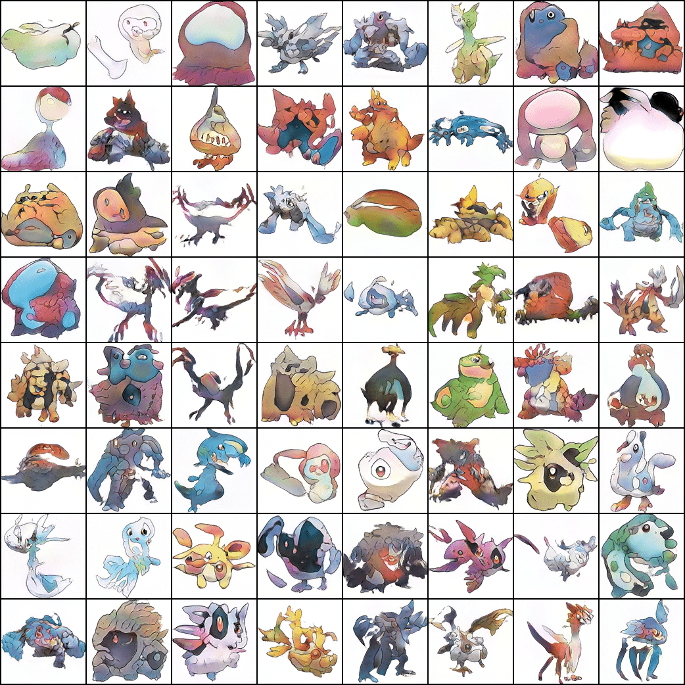

<div align="center">

# Your Project Name

<a href="https://pytorch.org/get-started/locally/"></a>
<a href="https://pytorchlightning.ai/"></a>
<a href="https://hydra.cc/"></a>
<a href="https://github.com/ashleve/lightning-hydra-template"></a><br>

</div>

## Description

Stylegan2-ada approach based on pytorch lightning. [Original code](https://github.com/rosinality/stylegan2-pytorch). 

With this approach you can train network to generate pokemons. For that you should download [pokemon dataset](https://www.kaggle.com/kvpratama/pokemon-images-dataset).  

<center>

</center>
<center>
<em>Generation example. The training took approximately 18 hours.</em>
</center>

## Dependencies

* CUDA 10.2
* All requirements

Install dependencies

```bash
# clone project
git clone https://github.com/toshiks/pockemon-stylegan.git
cd pockemon-stylegan

# [OPTIONAL] create conda environment
conda create -n myenv python=3.8
conda activate myenv

# install requirements
pip install -r requirements.txt
```

## How to run

Prepare dataset

```bash
python prepare_data.py --out data/lmdb --n_worker N_WORKER --size 128 DATASET_PATH
```

Train model with default configuration

```bash
# train on CPU
python run.py experiment=example_simple.yaml trainer.gpus=0

# train on GPU (two gpus with at least 8GB memory)
python run.py experiment=example_simple.yaml
```